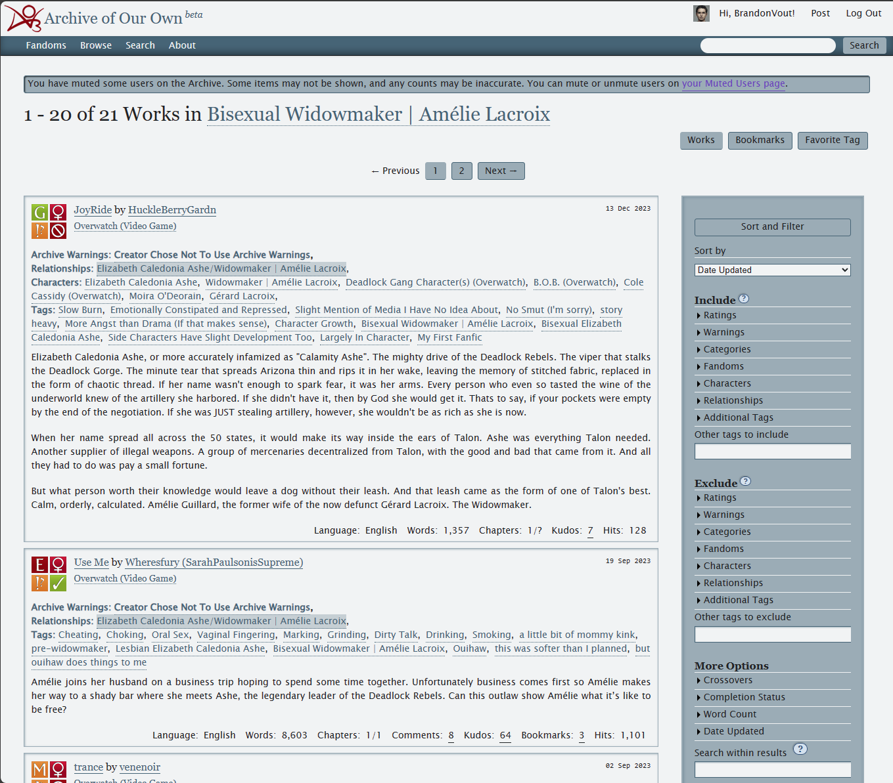
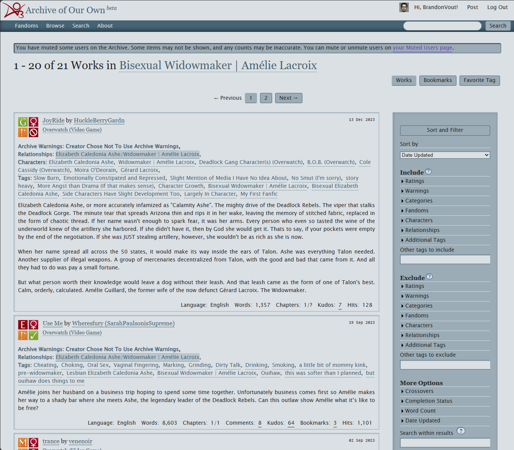
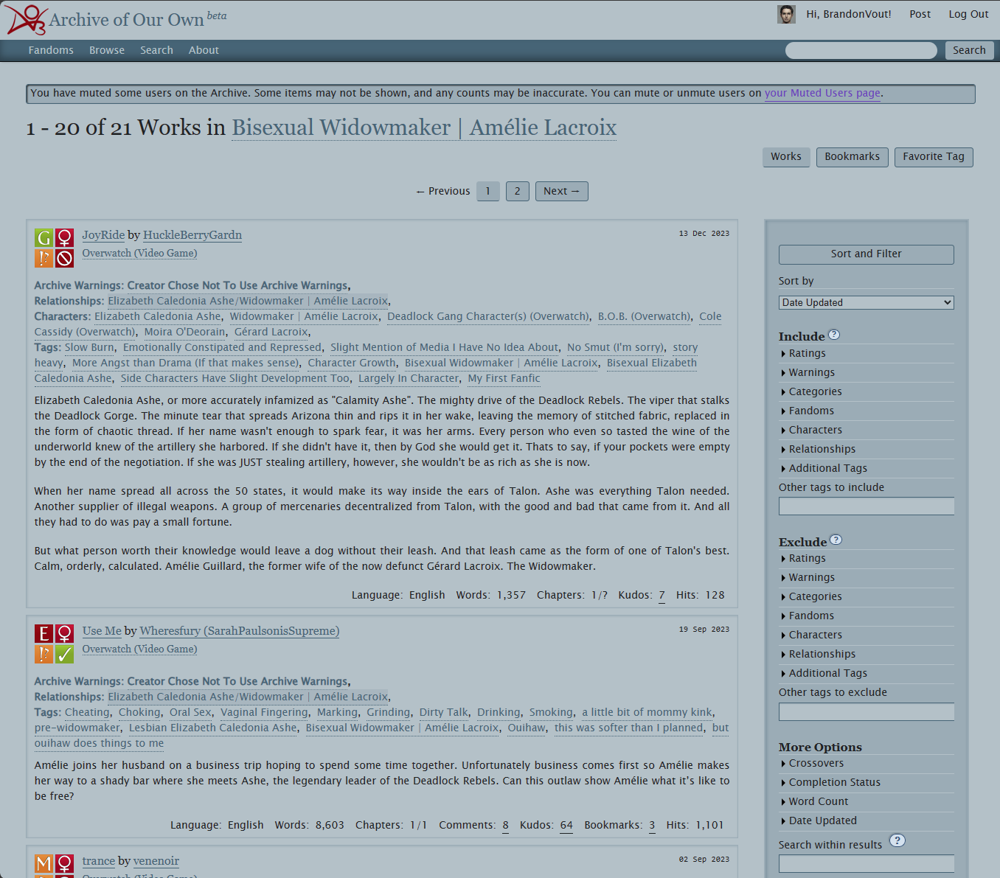
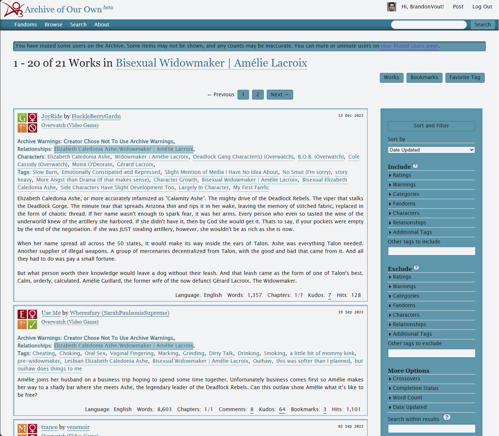
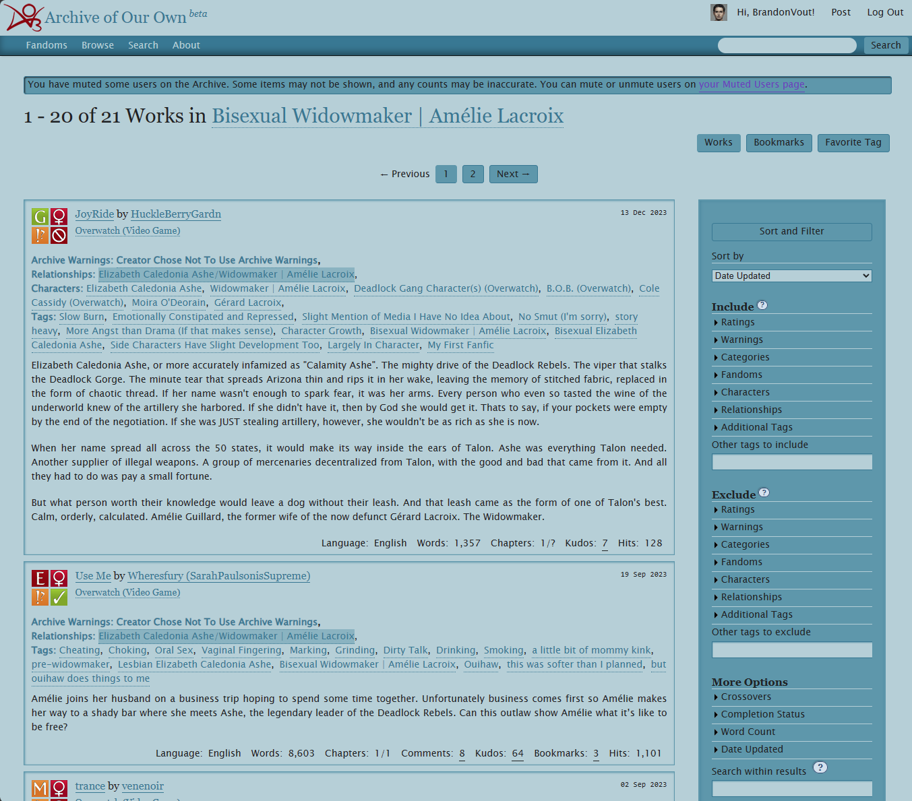
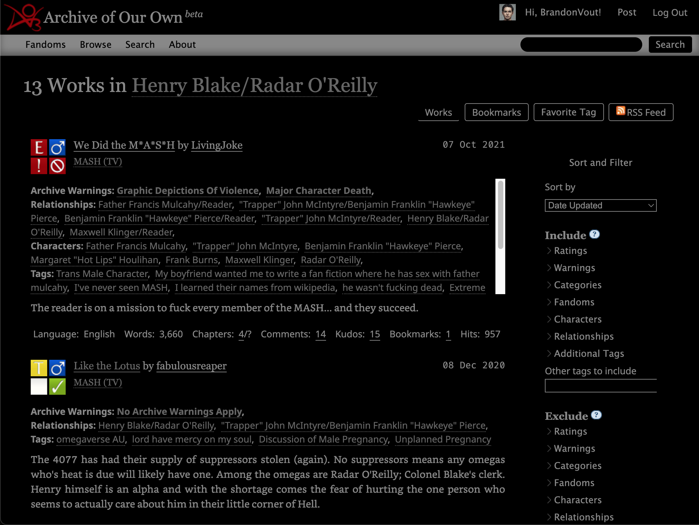
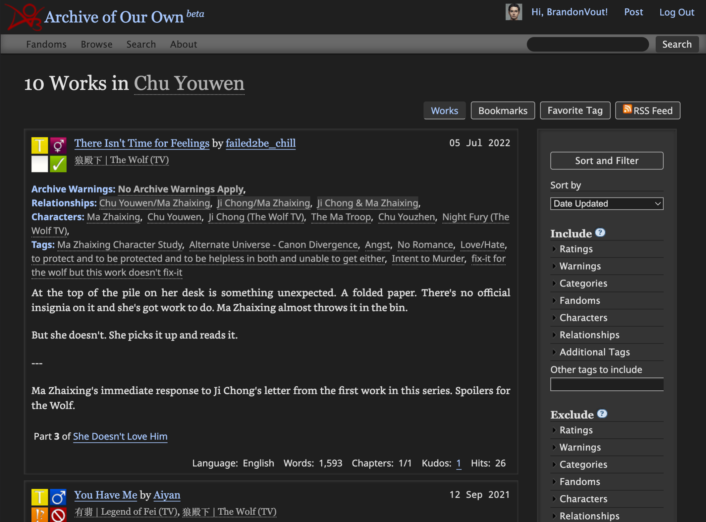
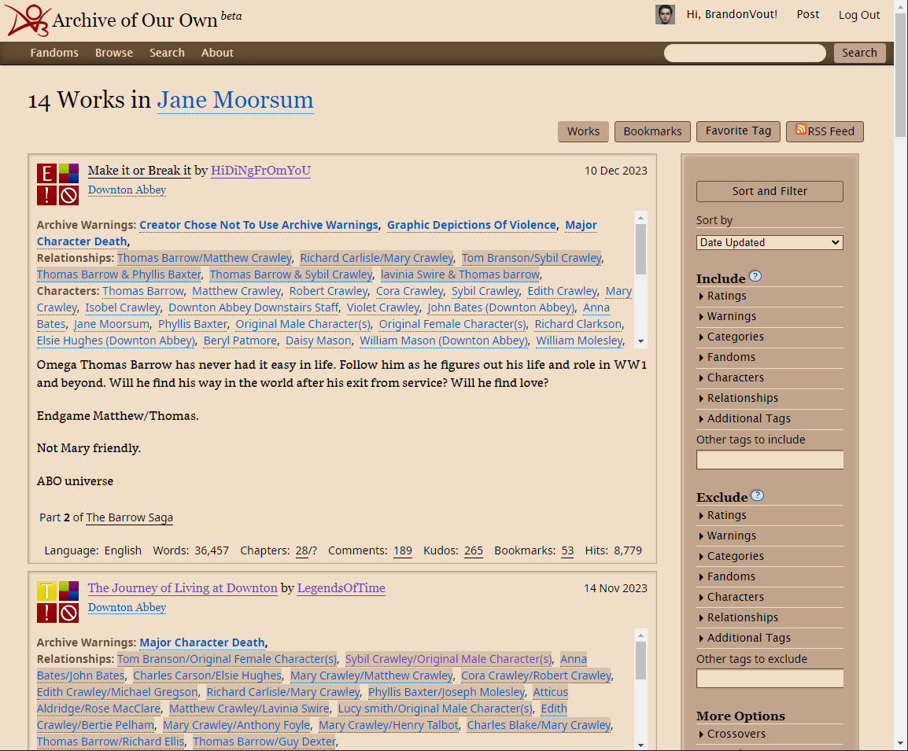
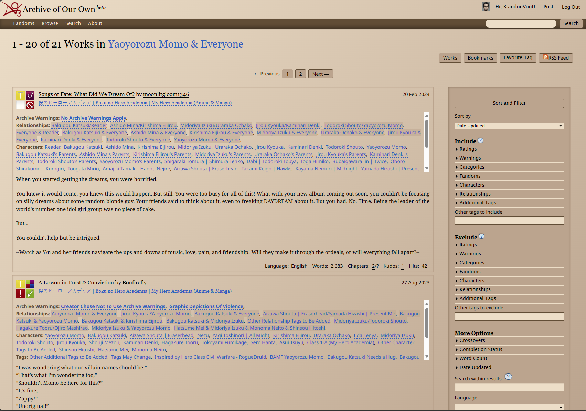

# Screenshots

## Grey Blue

### Grey Blue (Untinted)

### Grey Blue Tinted

### Grey Blue Tinted Dark

### Grey Blue/Green

### Grey Blue/Green Tinted

### Grey Blue/Green Tinted Dark

## Grey On Black

## Greymarch

### Dark

### Dim

## Night Owl

## Sepia

### Sepia

### Sepia High Contrast

### Sepia High Contrast Gradient

## Solarized

### Solarized Light

### Solarized Dark

